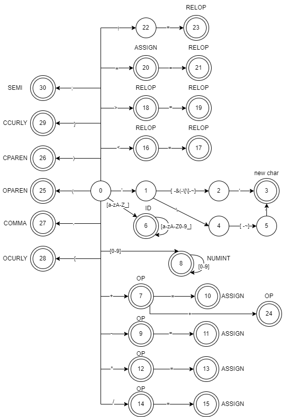

# Compiler_Lab
这是《编译原理》课程实验的代码，包含了词法分析器和语法分析器的部分实现，有关编译原理的更多代码可以看我的另一个仓库（lex）。以下内容摘自我的实验报告

## 词法分析器
### 实验目的
通过设计和实现一个简单的词法分析器，深入理解编译原理中词法分析的基本原理和流程，理解词法分析的概念，学习正规表达式和有限自动机的应用。

### 实验内容描述
实现一个简单的词法分析器，要求：
1. 输入：字符串
2. 输出：Token的序列
3. 单词的种类可以自行定义，正规表达式自行定义
4. 包含错误处理

### 方法
首先确定一组正规表达式，它们表示支持的输入格式，之后将它转化为NFA，通过一系列化简化为最小DFA。根据化简得到的DFA，使用一个switch()语句块作为基本结构来实现状态的变化，通过一次遍历输入的字符串来实现词法分析。

在分析标识符时，还需要检查它是否是一个保留字，这可以通过在运行词法分析器之前在符号表中预先写入保留字来实现。

此外，需要提供一个方法从文件中读取字符流。在将字符串输入词法分析器之前，需要对其进行预处理，去除其中的注释行（// Comments）和注释块（/* Comments */）。

### 假设
1. 输入字符流中的所有字符均为标准ASCII字符。
2. 符号表中标识符的信息仅有一个指针，它指向标识符的名称。
3. 所有的数字都是十进制整数，包括以0起始的数字（在C/C++中，以0开头的数字被识别为八进制数）。

### 相关的FA描述
#### 正则表达式
本实验中定义的所有正规表达式如下表所示：

|Lexeme|Token|Regex
|-|-|-
|int|INT|int
|char|CHAR|char
|return|RETURN|return
|unsigned|UNSIGNED|unsigned
|const|CONST|const
|for|FOR|for
|if|IF|if
|else|ELSE|else
|<|RELOP|<
|>|RELOP|>
|<=|RELOP|<=
|>=|RELOP|>=
|==|RELOP|==
|!=|RELOP|!=
|+|OP|+
|-|OP|-
|\*|OP|\*
|/|OP|/
|=|ASSIGN|=
|+=|ASSIGN|+=
|-=|ASSIGN|-=
|\*=|ASSIGN|\*=
|/=|ASSIGN|/=
|Furina_aaa123|ID|\[a-zA-Z_\]\[a-zA-Z0-9_\]\*
|114514|NUMINT|\[0-9\]\[0-9\]\*
|'\n'|CHARACTER|'[\^'\\\\]\|\\.'
|(|OPAREN|(
|)|CPAREN|)
|,|COMMA|,
|{|OCURLY|{
|}|CCURLY|}
|;|SEMI|;

#### DFA



### 数据结构描述

定义了一个attribute结构体，用于存放Token和标识符的信息，如下所示：

```cpp
struct attribute{
    explicit attribute(const std::string &_token, int val=-1);
    attribute(struct attribute const &attr);

    std::string token;
    int value;// 如果有非负值，代表符号表中的对应下标
};
```
其中，value的值用作自定义标识符的的指针或部分带属性值的词素的索引。对于没有属性值的串，该字段被初始化为-1.

此外，还使用了一个std::unordered_map结构来记录保留字和已经出现过的标识符，在识别到标识符时，会在其中查找是否是保留字或已经声明过的标识符，如果是则从表中直接取出，如果不是则新建一个表项，并生成相应的指针。

```cpp
std::unordered_map<std::string, struct attribute> attributes={
        {"int", attribute("INT")},
        {"char", attribute("CHAR")},
        {"return", attribute("RETURN")},
        {"unsigned", attribute("UNSIGNED")},
        {"const", attribute("CONST")},
        {"for", attribute("FOR")},
        {"if", attribute("IF")},
        {"else", attribute("ELSE")},
};
```

### 核心算法描述
#### 注释去除
先前已经提到，在将代码送入词法分析器之前，通过预处理去除了注释行（// Comments）和注释块（/\* Comments \*/）。对于前者，可以通过在读取字符流时保留换行符'\n'来确定注释的范围，之后遍历整个字符串，读到"//"时，将其后面直到换行符'\0'的所有字符跳过；对于后者，将不断向后跳过，直到匹配"*/"，在此中间的都认为是注释。

#### 状态机
状态机的基本结构是一个switch()语句块和一个int类型的state变量。在遍历整个字符串时，根据将要读入的一位字符next来修改state的值，例如：

```cpp
switch(state){
    case 0:// START
        if(!next) { ++cur;break; }// finished
        if(next=='\'') { state = 1;++cur; }
```

如果读到数字，直接继续向后读，直到下一个字符不是数字，并将读出的内容作为一个新的NUMINT，这样可以不用单独在程序中设计一个状态，对标识符的识别也做了同样的处理，但识别到标识符时，会首先在attributes中查找其是否是一个保留字，或者是否是已经声明过的变量，如果不是才会在符号表中插入新的项。

## 语法分析器
### 实验目的
通过设计和实现一个简单的语法分析器，深入理解编译原理中语法分析的基本原理和流程，理解语法分析的概念，掌握FIRST集和FOLLOW集的计算过程，理解预测分析表的生成过程，理解预测分析的过程。

### 实验内容描述
实现一个简单的语法分析器，要求：
1. 输入：字符串、上下文无关文法CFG
2. 输出：推导过程的序列（自顶向下方法）或规约过程的序列（自底向上方法） 
3. 自行定义语句
4. 包含错误处理

### 方法
在本实验中，我通过实现一个LL(1)预测分析表来分析LL(1)文法。对于输入的文法，首先要计算FIRST集和FOLLOW集，然后根据这两个集合构造预测分析表Parsing table，最后根据预测分析表来分析输入的语句。每个部分的具体思路和实现将在下面的部分中详述。

### 假设
1. 输入的文法是一个LL(1)文法；
2. 输入的文法开始符号同样出现在非终结符的输入中，且每个终结符和非终结符的名称和前缀均不相同（因为没有词法分析），且不包含'@'、'\$'、"Furina"三个名称。@被用来表示空串，\$是预测分析阶段的结束符，Furina被用来表示结束输入；
3. 输入的产生式格式为A->α，其中A是一个非终结符，α是一个句子，产生式的左部和右部由”->”分隔开。

### 数据结构描述
#### 符号
使用一个自定义的结构体代表符号，如下所示：
```cpp
// 符号
struct Symbol{
    SymbolType type;
    std::string symbol;
    explicit Symbol(SymbolType t, const std::string &s){type=t; symbol=s;}
    Symbol(const Symbol &s){type = s.type; symbol = s.symbol;}
    Symbol(){type = EPSILON;}

    bool operator<(const Symbol& s2) const{
        if(type==EPSILON) return s2.type!=EPSILON;
        return symbol<s2.symbol;
    }
    bool operator>(const Symbol& s2) const{
        if(type==EPSILON) return false;
        return symbol>s2.symbol;
    }
    bool operator==(const Symbol& s2) const{
        return type==s2.type&&symbol==s2.symbol;
    }
};
```
该结构体有两个属性，type表示符号的类型，用于区分当前符号是终结符、非终结符还是空串。SymbolType是一个枚举类型，如下所示。symbol是符号的名称。此外，重载的==运算符是为了代码编写方便，而<运算符用作set和map结构的排序。
```cpp
enum SymbolType{
    TERMINAL,
    NON_TERMINAL,
    EPSILON,
};
```

#### 产生式
使用如下的结构表示产生式：
```cpp
// 产生式
// 不使用'|'来分隔多个产生式
struct Production{
    Symbol left;
    std::vector<Symbol> right;
    explicit Production(const Symbol &l, const std::vector<Symbol> &r){left=l; right=r;}
    Production()= default;
    bool operator<(const Production& p2) const{
        if(left<p2.left)return true;
        else if(left>p2.left)return false;
        int len1 = right.size(), len2 = p2.right.size();
        int min = len1>len2?len2:len1;
        for(int i=0;i<min;++i){
            if(right[i]<p2.right[i])return true;
            else if(right[i]>p2.right[i])return false;
        }
        return len1<len2;
    }
};
```
该结构体有两个属性，left是产生式的左部，它是一个非终结符，right是产生式的右部。<运算符同样用作set和map的排序。

#### 输入文法
文法是一个四元组，包含文法开始符号、终结符集、非终结符集和产生式集。文法开始符号使用自定义的Symbol结构，而后三个部分都使用了std::set，如下所示。
```cpp
Symbol start;// 文法开始符号
set<Production> productions;// 产生式
set<Symbol> terminals;// 所有的终结符
set<Symbol> non_terminals;// 所有的非终结符
```

此外，还需要一些结构，用于辅助预测分析，如下所示：
```cpp
map<Symbol, set<Symbol>> firstLeft;// 所有终结符和非终结符的FIRST
map<vector<Symbol>, set<Symbol>> firstRight;// 所有右侧产生式的FIRST
map<Symbol, set<Symbol>> follow;// 所有非终结符的FOLLOW
map<pair<Symbol, Symbol>, Production> parsing_table;// 预测分析表
```
- firstLeft是所有终结符和非终结符的FIRST集，它使用std::map实现，构建符号到它的FIRST集的映射；
- firstRight是所有右侧产生式的FIRST集，这一部分被用来计算预测分析表；
- follow是所有非终结符的FOLLOW集；
- parsing_table是预测分析表，我没有使用二维数组结构，而是将一个Symbol对映射到产生式，其中前一个Symbol是非终结符，后一个是终结符（或\$）。

### 核心算法描述
#### FIRST集计算
计算FIRST集的函数声明如下所示：
```cpp
/**
 * 计算单个符号的FIRST
 * @param symbol : 需要计算的符号
 * @param productions : 文法的全部产生式
 * @param allFirst : 所有符号的FIRST集
 */
void calcFirst(const Symbol &symbol, const std::set<Production> &productions, std::map<Symbol, std::set<Symbol>>& allFirst);
```
FIRST集的计算主要有三条规则。
- 如果symbol是一个终结符，那么它的FIRST集只包含自身；
- 如果有一个产生式X->ε，将ε加入X的FIRST集；
- 如果有产生式X->Y1Y2…Yn，则递归计算FIRST(Y1)，…，FIRST(Yn)，则首先递归计算FIRST(Y1)，之后将FIRST(Y1)中除空串外的元素加入FIRST(X)。如果FIRST(Y1)包含ε，则继续递归计算FIRST(Y2)并执行相同的操作；如果不含空串，则算法结束。最后，如果Y1至Yn的FIRST集都包含空串，将空串也加入FIRST(X)。
- 重复上述计算过程，直到所有元素的FIRST集不再更新。

需要说明的是，计算产生式右部的FIRST集的方法也应用了上面的规则，但它并不进行重复迭代，也不会递归计算，因为这个方法在所有符号的FIRST集计算完毕之后才调用。

```cpp
/**
 * 计算一个多符号表达式的FIRST
 * @param symbols : 需要计算的符号表达式
 * @param firstLeft : 已经计算完成的单个符号的FIRST
 * @param firstRight : 所有多符号表达式的FIRST
 */
void calcRightFirst(const std::vector<Symbol>& symbols, const std::map<Symbol, std::set<Symbol>>& firstLeft, std::map<std::vector<Symbol>, std::set<Symbol>>& firstRight);
```

#### FOLLOW集计算
计算FOLLOW集的函数声明如下所示：
```cpp
/**
 * 计算单个符号的FOLLOW集
 * @param productions : 文法的全部产生式
 * @param allFirst : 计算好的FIRST集
 * @param allFollow : 所有符号的FOLLOW集
 */
void calcFollow(const std::set<Production> &productions, const std::map<Symbol, std::set<Symbol>>& allFirst, std::map<Symbol, std::set<Symbol>>& allFollow);
```
计算FOLLOW集也有一系列规则。需要说明的是，在计算FOLLOW集之前，需要首先将结束标记\$加入到文法开始符号S的FOLLOW集。

在每次更新FOLLOW集的过程中，遍历所有产生式，按照如下规则更新FOLLOW集：
1. 如果存在产生式A->aBb，则将b的FIRST集中除空串外的所有符号加入FOLLOW(B)（b的FIRST集可以复用上面的calcRightFirst()来计算）；如果b的FIRST集包含空串，则将FOLLOW(A)中的所有元素加入FOLLOW(B)；
2. 如果存在产生式A->aB，也将FOLLOW(A)中的所有元素加入FOLLOW(B)。
使用一个循环不断运行上述更新过程，直到没有元素被加入任意元素的FOLLOW集。

### 生成预测分析表
生成预测分析表的函数声明如下所示：
```cpp
/**
 * 计算预测分析表
 * @param parsing_table : 预测分析表对象
 * @param productions : 所有产生式的集合
 * @param firstRight : 所有右侧表达式的FIRST集合
 * @param allFollow : 所有非终结符的FOLLOW集
 */
void getParsingTable(std::map<std::pair<Symbol, Symbol>, Production> &parsing_table, const std::set<Production> &productions, const std::map<std::vector<Symbol>, std::set<Symbol>> &firstRight, const std::map<Symbol, std::set<Symbol>>& allFollow);
```
遍历一次所有产生式，按以下规则向预测分析表中插入产生式。即，对于某个产生式A->a：
1. 对于FIRST(a)中的每个终结符t，将A->a加入parsing_table[{A,t}]；
2. 如果FIRST(a)包含空串，则对于FOLLOW(A)中的每个终结符b（或$），将A->a加入parsing_table[{A,b}]。

### 分析输入串
分析的函数声明如下所示：
```cpp
/**
 * 分析输入的串，【打印】它的一个最左推导
 * @param inputStream : 输入串
 * @param parsing_table : 预测分析表
 * @param start : 文法开始符号
 */
void analyze(const std::vector<Symbol> &inputStream, const std::map<std::pair<Symbol, Symbol>, Production> &parsing_table, const Symbol &start);
```
这个函数不更新任何内容，仅在控制台使用标准输出流输出inputStream的一个最左推导。
1. 首先，设置一个栈，将$和文法开始符号start依次入栈，使用一个指针（对于vector，是一个int类型变量ptr）指向输入流的第一个符号；并向输入流最后插入符号\$。
2. 用X表示栈顶符号，当栈顶不为\$时，循环执行以下内容（每次执行完更新栈顶）：
    - 若X等于ptr指向的符号，将X出栈，ptr前移；
    - 若X是终结符或X是非终结符但分析表中没有{X,\*ptr}（\*ptr代表ptr指向的元素），给出错误提示；
    - 如果分析表中有{X,*ptr}的条目，将该条目的产生式输出作为最左推导的一个步骤，之后将X出栈，并将产生式的右部倒序入栈。


